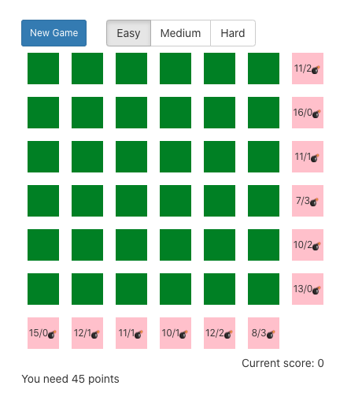
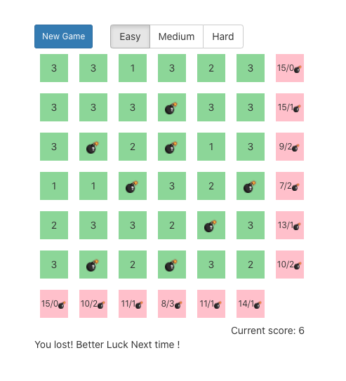
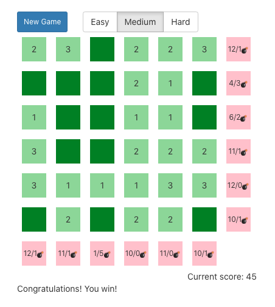

# Simple Minesweeper

This game was inspired by the famous minesweeper game and was done in the context of learning javascript and the react framework in 2018.

## The rules

Underneath each green square lies either a bomb or a point (1, 2 or 3). The pink squares indicate how many points and bombs are available in a given row or column.

Increasing the difficulty reduces the amount of points available in the grid.  

**The player loses when he/she selects a bomb.**

**And wins when he/she reaches 45 points**

## Running the app
This project was bootstrapped with [Create React App](https://github.com/facebook/create-react-app).

In the project directory, you can run:

`npm start`

Runs the app in the development mode. 
Open [http://localhost:3000](http://localhost:3000) to view it in the browser.

